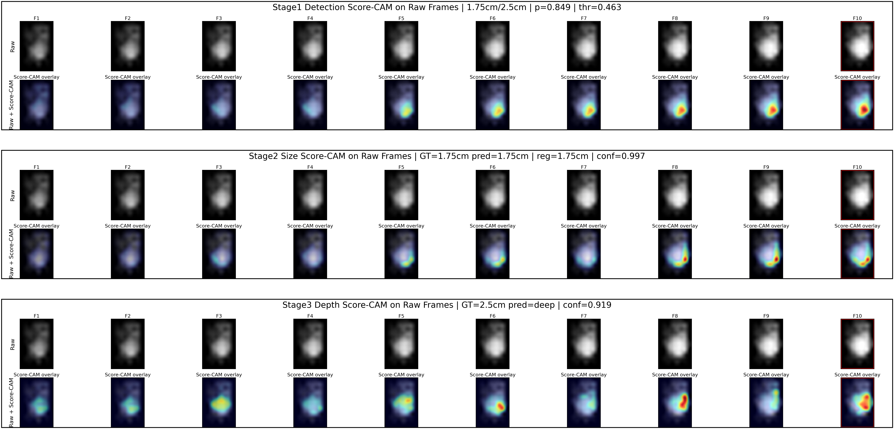

# R5 Detection-Gated Tactile Inversion

This repository snapshot is the reproducible release package for the latest R5 tactile nodule localization algorithm.

The method is a **detection-gated residual inversion** pipeline:

```text
dynamic tactile sequence -> evidence gate -> residual size inversion -> size-conditioned depth
```

The detector first decides whether a 10-frame tactile window contains lesion-responsive evidence. After the detector threshold is fixed, the detector is frozen. A compact residual branch then estimates nodule size as the principal endpoint and estimates coarse depth as a conditional auxiliary endpoint.

## Headline File3 Results

| Block | Metric | Value |
|---|---:|---:|
| Frozen detector | AUC | 0.903 |
| Frozen detector | F1 at threshold 0.463 | 0.775 |
| R5 gated inversion | Size Top-1 | 0.759 |
| R5 gated inversion | Size Top-2 | 0.906 |
| R5 gated inversion | Size MAE | 0.105 cm |
| R5 gated inversion | Depth accuracy | 0.610 |
| R5 gated inversion | Depth Top-2 | 0.852 |



## Package Layout

```text
github_reviewer_release/
  tactile_inversion/        # Model code, training, evaluation, and Score-CAM CLIs
  data/raw/                 # Full tactile CSV dataset, 126 recordings
  data/labels/              # Active File1/File2/File3 manual labels
  checkpoints/              # Convenience copies of released weights
  results/frozen_detector/  # Frozen evidence-gate checkpoint and metadata
  results/r5/               # R5 checkpoint, predictions, metrics, and figures
  tests/                    # Release layout tests
```

## Installation

Python 3.9+ is recommended.

```bash
cd github_reviewer_release
pip install -r requirements.txt
```

For GPU retraining, install a CUDA-enabled PyTorch build from the official PyTorch instructions.

## Quick Start

Run one released sample through the detector and R5 residual branch:

```bash
python -m tactile_inversion.demo --device cpu
```

For a faster smoke test without regenerating Score-CAM:

```bash
python -m tactile_inversion.demo --device cpu --no-scorecam
```

Recompute the File3 positive-window metrics from the released checkpoints:

```bash
python -m tactile_inversion.evaluate --device cpu
```

Regenerate the task-guided Score-CAM figure:

```bash
python -m tactile_inversion.make_scorecam --device cpu
```

## Retraining

Retrain the frozen evidence detector:

```bash
python -m tactile_inversion.train_detector --device cuda
```

Retrain the R5 residual inversion branch:

```bash
python -m tactile_inversion.train_residual --device cuda --preset r5
```

Both commands use release-relative data and label paths.

## Reproducibility Checks

```bash
python -m compileall tactile_inversion
python -m unittest discover tests
python -m tactile_inversion.demo --device cpu --no-scorecam
python -m tactile_inversion.evaluate --device cpu
```

The evaluation command should reproduce the released R5 metrics within normal deterministic CPU/GPU numerical tolerance. The expected acceptance region is size Top-1 at least 0.75, size Top-2 at least 0.90, size MAE at most 0.11 cm, and depth accuracy at least 0.60.

## Data Usage

The included tactile CSV files and labels are provided for research reproducibility of the submitted algorithm. Please cite the associated manuscript when using this dataset or release package.

